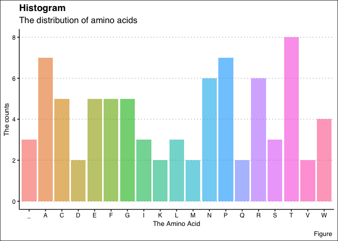

<!-- README.md is generated from README.Rmd. Please edit that file -->

# MolBio

<!-- badges: start -->

[](https://lifecycle.r-lib.org/articles/stages.html#experimental)
<!-- badges: end -->

``` r
library(MolBio)
```

## Overview

`MolBio` is a package regarding the Central Dogma of Molecular Biology.

`MolBio` provides a consistent set of verbs that help you solve the most
common molecular biology challenges.

-   `make_dna()` generates a random sample of DNA.

-   `make_rna()` substitutes nucleotides in DNA to create RNA.

-   `make_codon()` makes codons based on the RNA sequence.

-   `make_polypeptide()` makes polypeptides based on the codon sequence.

-   `find_aa_distribution()` makes a histogram of the distribution of
    counts of amino acids in a polypeptide.

-   `the_codon_table` Codon to Amino Acid table.

You can learn more about the functions in `vignette(MolBio)`.

If you are new to `MolBio`, the best place to start is this github
repository.

(If you’re trying to generate a protein sequence from a DNA sequence,
see `vignette(MolBio)`

## Installation

### Development Version

The easiest way to get `MolBio` is to install the whole package:

``` r
install.packages("devtools")
devtools::install_github("rforbiodatascience22/group_20_package")
```

The link to the Github repository is :

## Usage

**Synthesize DNA with** `make_dna()`

The first verb is `make_dna()`. It creates a string of DNA

``` r
library(MolBio)
```

``` r
dna_seq <- make_dna(240)
dna_seq
#> [1] "ACATCCAAGTCCATCCACCTGTGCGGAAGTAACATAACGCCTATACACATACCAACGTTCCAATACCCAAAGCCAAAAAGATTCGACCCAGGTCACCTACGCAGACCGCGTACTCATCTGCTGACGCTACTCTATATGCTCACTCTGATGCCAGGAGGACACCTCATTAGGGGTGGTCCTCGTGCACCGCAGGGAGATGTGCCTAATTGGTCCCTGTCGACGGAGAATAGTAAGACTCTA"
```

------------------------------------------------------------------------

**Transcribe RNA with** `make_rna()`

The second verb is `make_rna()`. It creates a string of RNA

``` r
rna_sequence <- make_rna(dna_seq)
rna_sequence
#> [1] "ACAUCCAAGUCCAUCCACCUGUGCGGAAGUAACAUAACGCCUAUACACAUACCAACGUUCCAAUACCCAAAGCCAAAAAGAUUCGACCCAGGUCACCUACGCAGACCGCGUACUCAUCUGCUGACGCUACUCUAUAUGCUCACUCUGAUGCCAGGAGGACACCUCAUUAGGGGUGGUCCUCGUGCACCGCAGGGAGAUGUGCCUAAUUGGUCCCUGUCGACGGAGAAUAGUAAGACUCUA"
```

------------------------------------------------------------------------

**Start Initiation and Elongation of RNA with** `make_codon()`

The third verb is `make_codon()`. It creates separate strings of codons

``` r
codon_produced <- make_codon(rna_sequence)
codon_produced
#>  [1] "ACA" "UCC" "AAG" "UCC" "AUC" "CAC" "CUG" "UGC" "GGA" "AGU" "AAC" "AUA"
#> [13] "ACG" "CCU" "AUA" "CAC" "AUA" "CCA" "ACG" "UUC" "CAA" "UAC" "CCA" "AAG"
#> [25] "CCA" "AAA" "AGA" "UUC" "GAC" "CCA" "GGU" "CAC" "CUA" "CGC" "AGA" "CCG"
#> [37] "CGU" "ACU" "CAU" "CUG" "CUG" "ACG" "CUA" "CUC" "UAU" "AUG" "CUC" "ACU"
#> [49] "CUG" "AUG" "CCA" "GGA" "GGA" "CAC" "CUC" "AUU" "AGG" "GGU" "GGU" "CCU"
#> [61] "CGU" "GCA" "CCG" "CAG" "GGA" "GAU" "GUG" "CCU" "AAU" "UGG" "UCC" "CUG"
#> [73] "UCG" "ACG" "GAG" "AAU" "AGU" "AAG" "ACU" "CUA"
```

------------------------------------------------------------------------

**Protein structure creation with** `make_polypeptide()`

The fourth verb is `make_polypeptide()`. It creates a polypeptide
sequence from the codons.

``` r
polypeptide_sequence <- make_polypeptide(codon_produced)
polypeptide_sequence
#> [1] "TSKSIHLCGSNITPIHIPTFQYPKPKRFDPGHLRRPRTHLLTLLYMLTLMPGGHLIRGGPRAPQGDVPNWSLSTENSKTL"
```

------------------------------------------------------------------------

**Find the distribution of amino acids in the polypeptide with**
`find_aa_distribution()`

The fifth verb is `find_aa_distribution()`. It plots a histogram of the
distribution of amino acids in the polypeptide.

``` r
distrib_plot <- find_aa_distribution(polypeptide_sequence)
distrib_plot
```



------------------------------------------------------------------------

Alternatively, the functions can be used in conjunction with one
another.

``` r
make_dna(20) %>% 
  make_rna() %>% 
  make_codon() %>% 
  make_polypeptide() %>% 
  find_aa_distribution()
```

------------------------------------------------------------------------

## Getting help

If you encounter a clear bug, please file an issue with a minimal
reproducible example on GitHub. For questions and other discussion,
please email `s172084@dtu.dk`

Please note that this project is released with a Contributor Code of
Conduct. By participating in this project you agree to abide by its
terms.
